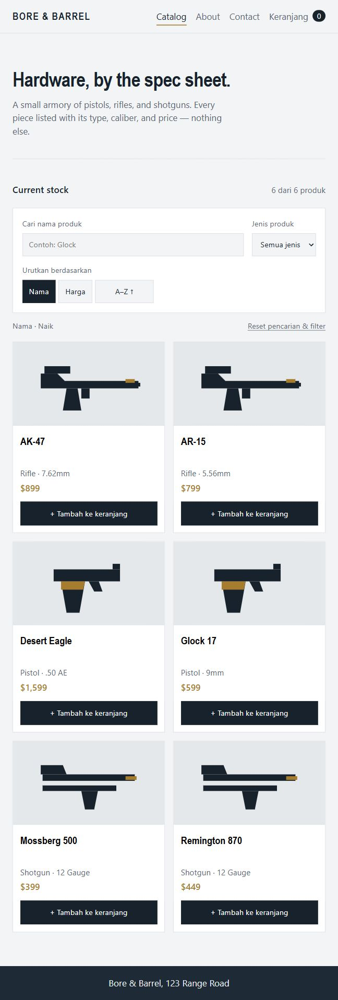
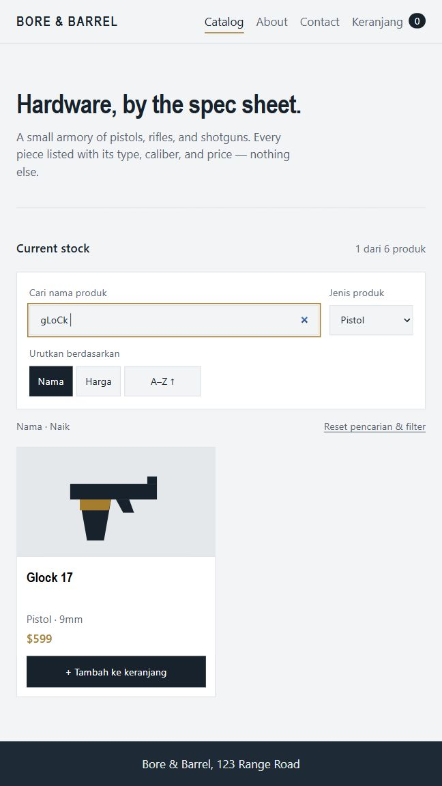
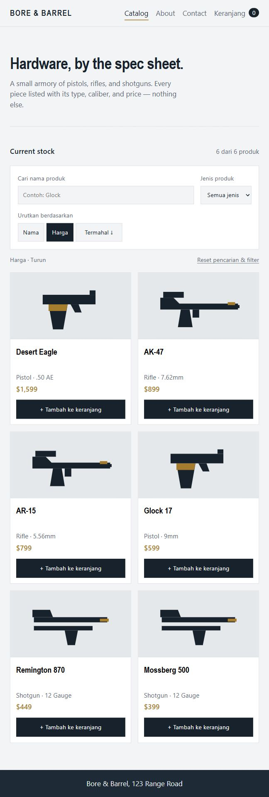
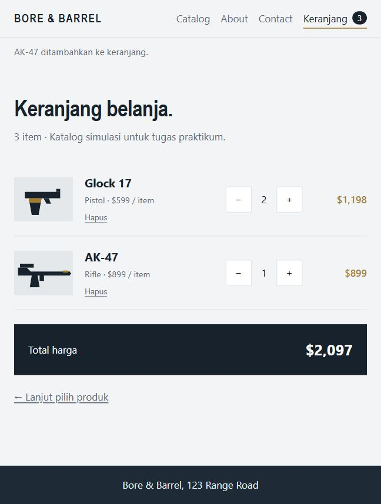

# Laporan Tugas Praktikum PPB

Tanggal pengujian: 5 Oktober 2026. Aplikasi: Bore & Barrel (React, Vite, PWA).

## 1. Konsistensi ukuran kartu

**Langkah pengerjaan:**

1. Mengubah `.card-img` menjadi `width: 100%`, tinggi tetap `160px`, dan `object-fit: contain`.
2. Menyusun kartu secara vertikal dengan flexbox, menyediakan ruang nama produk, dan memisahkan tombol detail dari tombol tambah.
3. Mempertahankan grid responsif; pada layar hingga 560px gambar menggunakan tinggi seragam `130px`.

**Analisis singkat:** Tinggi area gambar ditentukan oleh CSS, sehingga gambar dengan rasio aspek berbeda tetap berada di area yang sama tanpa dipotong. Flexbox menjaga tombol tambah sejajar. Saat pengujian pada lebar browser 648px, keenam gambar memiliki ukuran sekitar 290,8 × 160px dan semuanya berhasil dimuat. Screenshot memperlihatkan setiap baris kartu dengan tinggi yang seragam. Gambar bawaan repository memiliki rasio yang sama; perlindungan terhadap rasio berbeda diterapkan melalui tinggi tetap dan `object-fit`.

## 2. Pencarian dan filter jenis produk

**Langkah pengerjaan:**

1. Menambahkan state untuk kata pencarian dan pilihan jenis produk di `Catalog.jsx`.
2. Menggabungkan pencocokan nama dan jenis menggunakan kondisi AND di fungsi `selectProducts`.
3. Menormalisasi kata pencarian dengan `trim()` dan `toLowerCase()`, lalu menampilkan jumlah hasil, pesan hasil kosong, serta tombol reset.

**Analisis singkat:** Pencarian ` gLoCk ` dengan filter Pistol menghasilkan satu produk, yaitu Glock 17. Spasi di tepi dan huruf besar/kecil tidak mengganggu pencarian. Ketika jenis diubah menjadi Rifle, hasil menjadi kosong karena produk harus memenuhi kedua kriteria. Dengan demikian filter dan pencarian bekerja bersamaan, bukan saling menggantikan.

## 3. Toggle pengurutan nama dan harga

**Langkah pengerjaan:**

1. Menambahkan tombol Nama dan Harga untuk menentukan dasar pengurutan.
2. Menambahkan toggle arah dan menyesuaikan labelnya menjadi A–Z/Z–A atau Termurah/Termahal.
3. Mengurutkan hasil setelah pencarian dan filter, menggunakan `localeCompare` untuk nama serta selisih angka untuk harga.

**Analisis singkat:** Saat Harga → Termahal dipilih, Desert Eagle ($1.599) tampil pertama, diikuti AK-47 ($899), AR-15 ($799), Glock 17 ($599), Remington 870 ($449), dan Mossberg 500 ($399). Toggle Termurah menghasilkan urutan sebaliknya. Pengurutan Nama juga mendukung kedua arah. Penanda tombol aktif dan keterangan arah membantu pengguna memahami urutan yang sedang diterapkan.

## 4. Keranjang belanja

**Langkah pengerjaan:**

1. Menempatkan state keranjang di `App.jsx` agar dapat digunakan bersama oleh katalog, header, dan halaman keranjang.
2. Menambahkan tombol tambah di setiap kartu dan badge jumlah unit pada header.
3. Membuat halaman `Cart.jsx` dengan tombol −/+, hapus, subtotal, dan total harga.
4. Menghitung jumlah item serta total dari data produk dan kuantitas. Kuantitas nol menghapus produk agar tidak menghasilkan jumlah negatif.

**Analisis singkat:** Dua Glock 17 menghasilkan subtotal $1.198; satu AK-47 menghasilkan $899. Totalnya $2.097, dan badge menampilkan 3 karena yang dihitung adalah seluruh unit, bukan jumlah jenis produk. Menambah satu Glock lagi menghasilkan total $2.696. Pengurangan kuantitas, penghapusan produk, dan kondisi keranjang kosong juga diuji. Data tetap tersedia saat berpindah tab; reload memulai keranjang kosong karena state disimpan dalam memori.

## 5. Pengujian akhir

| Pemeriksaan | Hasil |
| --- | --- |
| `npm test` | 3 tes lulus: kombinasi pencarian/filter, empat urutan sort, kuantitas dan total keranjang |
| `npm run lint` | Lulus |
| `npm run build` | Lulus, termasuk manifest dan service worker PWA |
| Browser | Pencarian/filter gabungan, hasil kosong, reset, toggle sort, tambah berulang, kuantitas, hapus, dan keranjang kosong berhasil |
| Gambar produk | Semua gambar berhasil dimuat dan tinggi area gambar seragam |

**Analisis akhir:** Semua fitur tugas telah diterapkan dan diverifikasi melalui tes logika serta interaksi browser. Screenshot di atas merupakan hasil aplikasi yang berjalan lokal. Dokumentasi ini mencatat langkah implementasi, bukti hasil, dan penjelasan relevan untuk setiap fitur.

Repository hasil: [JLennon10/PWA1_PrakPPB-Tugas](https://github.com/JLennon10/PWA1_PrakPPB-Tugas).
